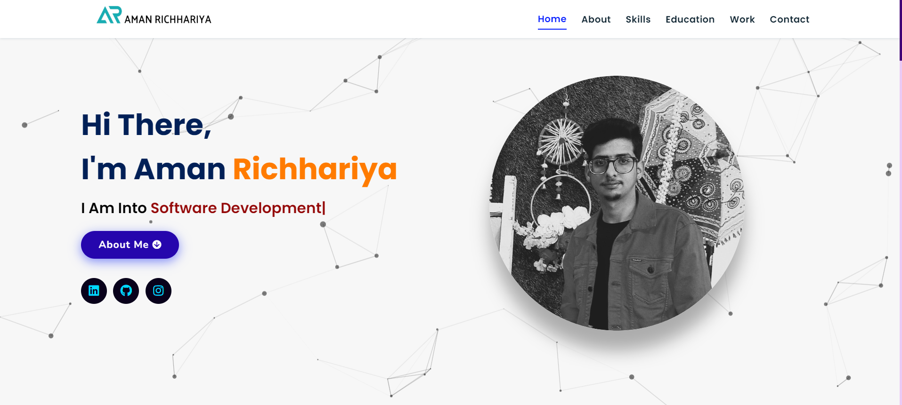
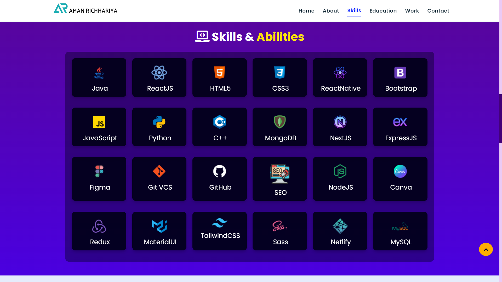
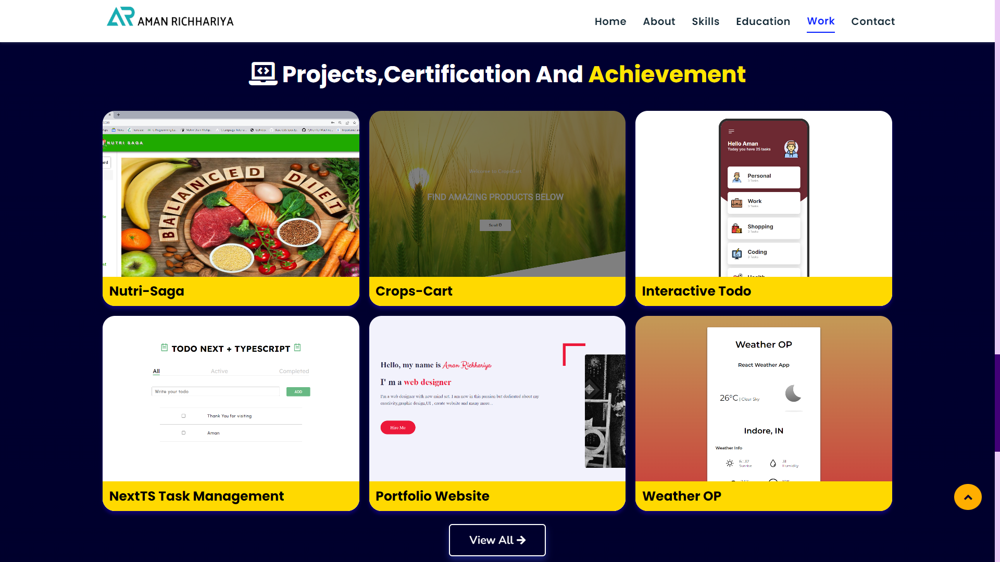
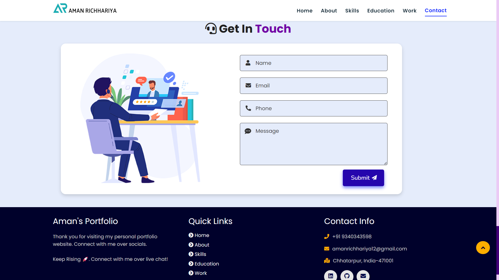

<h1 align="center">Hi 👋, I'm Aman Richhariya</h1>
<h3 align="center">Portfolio</h3>

### Link of the app: [Aman Portfolio](https:/).

### How to start?

1. clone the app
2. Need any one extension Given below -
  (i) - Live server
  (ii) - Live Preview by Microsoft
3. Start Live Server or Live Preview

  

- 👨‍💻 All of my projects are available at (https://github.com/ALazzyDragoCoder)

- 📝 I regularly Learm New Technology

- 📫 How to reach me **amanrichhariya12@gmail.com**

<h3 align="left">Connect with me:</h3>

<h3 align="left">Languages and Tools:</h3>

    

### Glimpses of project:

 
 

 
 

 
 

